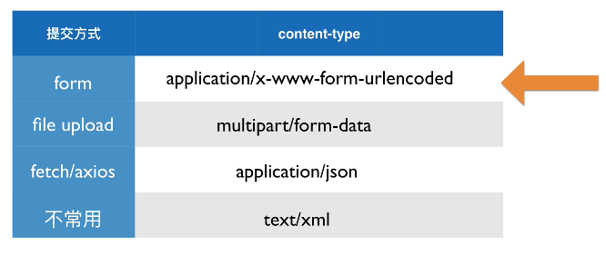

### 通过查询字符串传参

```html
http://haoqicat.com/?name=happypeter
```
上面的 `?name=happypeter` 就是所谓的查询字符串，这里面传递了一个参数，也就是 `name` ，参数值是 `happypeter` 。
谷歌开发者显示

```
Query String Parameters
name: happypeter
```

##### 传递多个参数

- 可以传递多组参数的，每组之间以 `&` 隔开

```
http://haoqicat.com/?name=happypeter&email=peter@peter.com
```

- 写成对象的形式，比如下面传到服务器 `shoe` 就是一个对象，而 `color` 和 `type` 是它下面的两个属性。

```bash
?order=desc&shoe[color]=blue&shoe[type]=converse
```

- 如果想在同意参数下添加一个备用的值，则用 `+` 号链接,email 这一项就是两个值了。

```
?name=peter&email=happypeter1983@gmail.com+b@b.com
```

### 通过POST请求发送数据

GET 请求是只读的，它只能从服务器获取信息，而POST请求就是来修改服务器的，例如修改数据库记录，上传一个文件等。
GET 请求中，我们一般通过对url添加参数的形式传递额外的参数给服务器，但是POST请求的情况下，通常我们都会把要传递的数据放在 request body中。

使用POST请求通过request body 携带数据到服务器端，有四种方式：

- 普通html表单中form提交方式：application/x-www-form-urlencoded
- 上传文件的惯用方式:multipart/form-data
- 通过fetch/axios 等客户端提交JSON 数据: application/JSON
- 还要一种方式是 text/xml，不常用了
- [四种常见的POST提交数据方式](https://imququ.com/post/four-ways-to-post-data-in-http.html)



####  application/x-www-form-urlencoded

这应该是最常见的 POST 提交数据的方式了。浏览器的原生
表单，如果不设置 enctype 属性，那么最终就会以 application/x-www-form-urlencoded 方式提交数据。
请求头类似下面这样（无关的省略了）

```bash
POST http://www.example.com HTTP/1.1
Content-Type: application/x-www-form-urlencoded;charset=utf-8
```

使用express 程序演示一下

```html
<!-- index.html -->
<form action="/login" method="post" >
    <label>username:</label>
    <input type="text" name="username">
    <input type="submit">
</form>
```

后台代码中

```js
//index.js
var bodyParser = require('body-parser')
// 创建 application/x-www-form-urlencoded 内容类型的解析器
var urlencodedParser = bodyParser.urlencoded({ extended: false })

app.post('/login', urlencodedParser, function (req, res) {
  console.log(req.body);
  //打印请求 payload 信息。
  console.log(req.rawHeaders);
  //打印请求头部非信息。
  res.send('welcome, ' + req.body.username)
})
```
