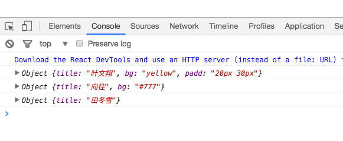

### 组件之间如何通信
一个组件如果无法做到通信是无法得到很好的复用的，因为有时候组件复用我们希望组件的UI会有点点区别,下来实现一个简单的通信来说明。

```
//Btn.js
import React from 'react';
class Btn extends React.Component{
  render(){
    let styles = {
      padding:this.props.padd,
      fontSize:"18px",
      backgroundColor:this.props.bg
    }
    console.log(this.props);
    return (
      <button style={styles}>{this.props.title}</button>
    )
  }
}
export default Btn;
```

```
//App.js
import React from 'react';
import Btn from "./Btn";
class App extends React.Component{
  render(){
    return (
      <div>
        <Btn title="叶文翔" bg='yellow' padd='20px 30px'/>
        <Btn title="向往" bg='#777'/>
        <Btn title="田冬雪"/>
      </div>
    )
  }
}
export default App;

```

上面 `Btn.js组件` 导出到 `App.js组件` 中，那么App组件就是Btn组件的父组件，我们在父组件App自定义标签中插入我们自定义的属性，然后在 `Btn.js` 文件的 `render()` 函数中打印 `this.props` 发现得到下图:



说明 `this.props` 可以拿到我们自定义属性的一个对象，然后在我们的 `Btn.js` 文件中，把需要自定义的属性全部用 `this.props.自定义属性名` 替换掉就行了，能够极大的提高组件的复用率。

### 组件中的默认属性
上面有个问题，如果没有传入相应的属性和属性值，组件可能会得不到正确的显示，这时候我们需要定义组件的默认属性了。定义方法：

```
//Btn.js
Btn.defaultProps = {
  title:'defaultTitle',
  bg:'#00bcd4',
  padd:'10px 20px'
}
```
这样当我们忘记传对应的属性的时候，组件就会显示默认的属性。

### 组件通信更好的方式
如果我们定义的属性很多，或者从后台传过来的属性来渲染，就会使用下面的方式

```
//Card.js
import React from 'react';
class Card extends React.Component{
  render(){
    return (
      <div className="card">
        <div className="card-index">{this.props.index}</div>
        <div className="card-desc">
          <h3>{this.props.title}</h3>
          <p>{this.props.data}</p>
        </div>
      </div>
    )
  }
}
Card.defaultProps = {
  index:1,
  title:"默认的一个标题",
  data:"2017.2.20"
}
export default Card;
```

```
//App.js
import React from 'react';
import Card from "./Card";
import "./main";
let arr = [
  {index:1,title:"标题一",date:"2017.2.22"},
  {index:2,title:"标题二",date:"2017.2.23"},
  {index:3,title:"标题三",date:"2017.2.24"},
  {index:4,title:"标题四",date:"2017.2.25"},
  {index:5,title:"标题五",date:"2017.2.26"}
]
class App extends React.Component{
  constructor(){
    super();
    this.state={
      date:arr
    }
  }
  render(){
    return (
      <div>
        {
          this.state.date.map( item => <Card key={Math.random()} title={item.title} index={item.index} date={item.date} />)
        }

        {/* 或者使用下面的方式 */}
        {/* {arr.map(
          item => <Card key={Math.random()} {...item} />
        )} */}
      </div>
    )
  }
}
export default App;
```
- 组件属性的数组最好交给 `state` 属性来统一管理。
- `{...item}` 这种写法更加的简便，`arr` 数组中每个对象都被当做了参数来传递，使用 `.map()` 方法，把属性插入了 `<Card />` 这个组件中。Spread 扩展操作符: `{...item}` ,直接把对象铺开放在了 `<Card />` 组件中。
