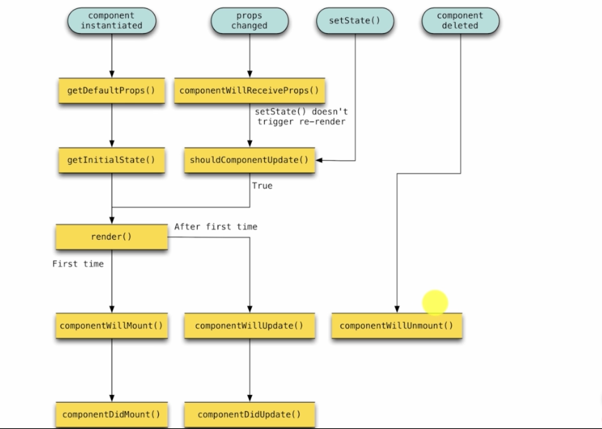

### 什么是组件的生命周期？
一个 React 组件的各个生命阶段会自动触发一些函数，这些被称为生命周期函数。
具体如下图：



##### 初始化:

- 获取默认属性值 `getDefaultProps()` :在组件挂载之前调用一次。
- 获取实例初始状态 `getInitialState()` :在组件类创建的时候调用一次，然后返回值被缓存下来。
- 首次渲染之前 `componentWillMount()` :服务器端和客户端都只调用一次，在初始化渲染执行之前立即调用。
- 渲染 `render()` 。
- 首次渲染之后 `componentDidMount()` :在初始化渲染执行之后立刻调用一次，仅客户端有效(服务器端不会调用)。

##### 更新:

- 属性被修改前 `componentWilReceiveProps()` :在组件接收到新的props的时候调用，在初始化渲染的时候，该方法不会调用。
- 判断是否需要更新 `shouldComponentUpdate()` :在接收到新的 `props` 或者 `state` ， 将要渲染之前调用。
- 更新之前 `componentWillUpdate()` :在接收到新的 `props` 或者 `state`时立刻调用。
- 渲染 `render()` 。
- 更新之后 `componentDidUpdate()` :在组件的更新同步到DOM之后立刻调用。

##### 销毁:

- 销毁前 `componentWillUnmount()` :在组件从DOM中被移除时立刻调用，一般在该方法中执行必要的清理。

### 一个demo

```
//App.js
import React from "react";
import Test from "./Test";
class App extends React.Component{
  constructor(){
    super();
    this.state = {num:0,show:true};
    console.log("App 初始化获取state值");
  }
  componentWillMount(){
    console.log("App 组件将要挂载");
  }
  componentWilReceiveProps(nextProps){
    console.log("App Props改变后,组件将要更新");
  }
  shouldComponentUpdate(nextProps,nextState){
    console.log('App 组件是否应该跟新,改变后Props的值：',nextProps,'改变后state的值：',nextState);
    if(nextState.num<5){
      return true;
    }
    return false;
  }
  componentWillUpdate(nextProps,nextState){
    console.log('App 组件将要跟新,改变后Props的值：',nextProps,'改变后state的值：',nextState);
  }
  componentDidUpdate(prevProps,prevState){
    console.log('App 组件跟新完毕,Props的上一个值：',prevProps,'state的上一个值：',prevState);
  }
  render(){
    console.log("App 渲染");
    return (

      <div>
        <div>
          数值：{this.state.num}
        </div>
        <button onClick={()=>this.setState({num:this.state.num+1})}>加一</button>
        <Test childNum = {this.state.num} />
      </div>
    )
  }
  componentDidMount(){
    console.log("App 组件挂载完毕");
  }
}
export default App;
```

```
//Test.js
import React from "react";

export default class Test extends React.Component{
  constructor(){
    super();
    console.log("Test 初始化获取state值");
  }

  componentWillMount(){
    console.log("Test 组件将要挂载");
  }
  componentWilReceiveProps(nextProps){
    console.log("Test Props改变后,组件将要更新");
  }
  componentWillUpdate(nextProps,nextState){
    console.log('Test 组件将要跟新,改变后Props的值：',nextProps,',改变后state的值：',nextState);
  }
  componentDidUpdate(prevProps,prevState){
    console.log('Test 组件跟新完毕,Props上一个的值：',prevProps ,'，state上一个的值：',prevState);
  }
  componentWillUnmount(){
    console.log(`我要被销毁了`);
  }
  render(){
    console.log("Test 渲染");
    return (
      <div>我是test组件：{this.props.childNum}</div>
    )
  }
  componentDidMount(){
    console.log("Test 组件挂载完毕");
  }
}
```

刷新后初始化，console中输出

```
 App 初始化获取state值
 App 组件将要挂载
 App 渲染
 Test 初始化获取state值
 Test 组件将要挂载
 Test 渲染
 Test 组件挂载完毕
 App 组件挂载完毕
```

点击加1按钮，改变了 `this.state.num` 的值后：

```
App 组件是否应该跟新,改变后Props的值： Object {} 改变后state的值： Object {num: 1, show: true}
App 组件将要跟新,改变后Props的值： Object {} 改变后state的值： Object {num: 1, show: true}
App 渲染
Test 组件将要跟新,改变后Props的值： Object {childNum: 1} ,改变后state的值： null
Test 渲染
Test 组件跟新完毕,Props上一个的值： Object {childNum: 0} ，state上一个的值： null
App 组件跟新完毕,Props的上一个值： Object {} state的上一个值： Object {num: 0, show: true}
```

> 注意：`nextProps` 和 `nextState` 两个参数是接收的一个对象。
componentDidUpdate(prevProps,prevState)拿到的是上一个值。
>
