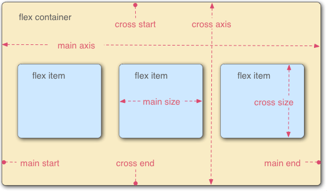
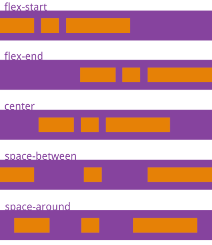
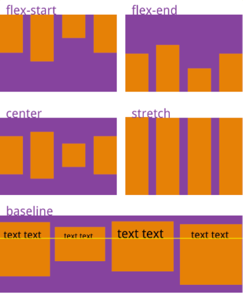
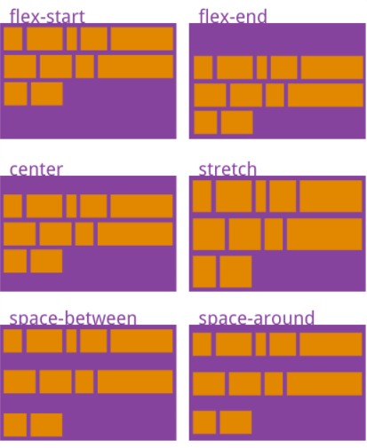
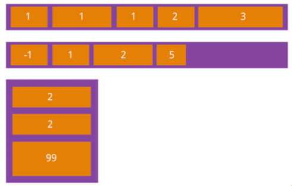
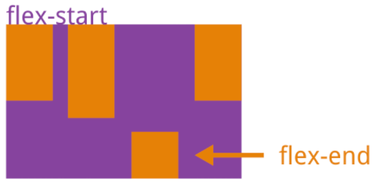

**任何一个容器都可以指定 Flex 布局**

```css
.box{
  display: flex;
}
```

**行内元素也可以使用 Flex 布局**

```css
.box{
  display: inline-flex;
}
```

**Webkit 内核的浏览器要加上 `-webkit` 前缀**

```css
.box{
  display: -webkit-flex;
  display: flex;
}
```

>设为 Flex 布局后，子项目的 `float` , `clear` 和 `vertical-align` 属性都将失效。
>

### 基本概念
采用 Flex 布局的元素(display:flex)，称为 Flex 容器（flex container），它的所有子元素自动成为容器成员，称为子项目。


容器默认存在两根主轴: `水平的主轴(main axis)` 和 `垂直的交叉轴(cross axis)`。

主轴的开始位置(与边框的交叉点)叫做 `main start` , 结束位置叫做 `main end` ;交叉轴的开始位置叫做 `cross start` , 结束位置叫做 `cross end` 。

项目默认沿着主轴排列,单个子项目占据的主轴空间叫做 `main size` ,占据的交叉轴空间叫做 `cross size` 。

---

### Flex 容器的六个属性

> - flex-direction : row  row-reverse  column  column-reverse
> - flex-warp : nowrap  wrap  wrap-reverse
> - flex-flow : `<flex-direction>` 和 `<flex-wrap>`
> - justify-content : flex-start  flex-end  center  space-beteen  space-around
> - align-items : flex-start  flex-end  center  baseline  stretch
> - align-content : flex-start  flex-end  center  space-beteen  space-around  stretch

#### flex-direction 属性
`flex-direction` 属性决定主轴的方向(即子项目的排列方向),它可能有4个值:

> - row(默认值) : 主轴为水平方向，起点在左端。
> - row-reverse : 主轴为水平方向，起点在右端。
> - column : 主轴为垂直方向，起点在顶部(top)。
> - column-reverse : 主轴为垂直方向，起点在底部(bottom)。


#### flex-wrap 属性
默认情况下，子项目都排在一条轴线上。 `flex-wrap` 属性定义了如果一条轴线排不下如何换行。

> - nowrap(默认值) : 不换行
> - wrap : 换行，第一行在上方
> - wrap-reverse : 换行，第一行在下方。如下图


#### flex-flow 属性
`flex-flow` 属性是 `flex-direction` 属性和 `flex-wrap` 属性的简写形式，默认值为 `row nowrap`

#### justify-content 属性
`justify-content` 属性定义了子项目在主轴上的对齐方式，他可能取五个值，具体对齐方式与轴的方向有关，下面假设主轴从左到右。

> - flex-start(默认值) : 左对齐
> - flex-end : 右对齐
> - center : 居中
> - space-beteen : 两段对齐，子项目之间的间隔都相等
> - space-around : 每个子项目两侧的间隔相等。所以，子项目之间的间隔比项目与容器边框的间隔大一倍



#### align-items 属性
`align-items` 属性定义子项目在交叉轴上如何对齐,默认情况下是垂直方向,从上到下。

> - flex-start : 交叉轴的起点对齐
> - flex-end : 交叉轴的终点对齐
> - center : 交叉轴的中点对齐
> - baseline : 项目的第一行文字的基线对齐
> - stretch(默认值) : 如果子项目未设置高或者设置为auto,将占满整个容器的高度



#### align-content 属性
`align-content` 属性定义了多根轴线的对齐方式，如果项目只有一根轴线，该属性不起作用。

> - flex-start : 与交叉轴的起点对齐
> - flex-end : 与交叉轴的终点对齐
> - center : 与交叉轴的终点对齐
> - space-beteen : 与交叉轴两端对齐，轴线之间的间隔平均分布
> - space-around : 每根轴线两侧的间隔都相等，所以，轴线之间的间隔比轴线与容器边框的间隔大一倍



---

### Flex 子项目的6个属性

> - order : `<integer>` (整数)
> - flex-grow : `<number>` (正整数)
> - flex-shrink : `<number>`(正整数)
> - flex-basis : `<length>` (子项目固定长度或者auto)
> - flex : 是 `flex-grow` `flex-shrink` `flex-basis` 的简写,默认值为 `0 1 auto` ,后两个属性可选
> - align-self : auto  flex-start  flex-end  center  baseline stretch

#### order 属性
`order` 属性定义子项目的排列顺序。数值越小，排列越靠前，默认为0。



#### flex-grow 属性
`flex-grow` 属性定义项目的放大比例，默认值为0，即存在剩余空间也不放大。

如果所有的子项目 `flex-grow` 属性都为1，存在剩余空间则它们将等分剩余空间，如果一个子项目的 `flex-grow` 属性为2，其他子项目都为1，则前者占据的剩余空间将比其他子项目多一倍，如下图。


#### flex-shrink 属性
`flex-shrink` 属性定义了项目的缩小比例，默认为1，即如果空间不足，该项目将缩小。

如果所有子项目的  `flex-shrink` 属性都为1，当空间不足时，都将等比例缩小，如果一个子项目的 `flex-shrink` 属性为0，其他子项目都为1，则空间不足时，前者不缩小，如下图。


#### flex-basis 属性
`flex-basis` 属性定义了在分配多余空间之前，子项目占据的主轴空间，浏览器根据这个属性，计算主轴是否有多余空间。它的默认值为 `auto` ，即子项目的本来大小。

它可以设为跟 `width` 或 `height` 属性一样的值(比如100px)，则项目将占据固定空间。

#### flex 属性
`flex` 属性是 `flex-grow` `flex-shrink` `flex-basis` 的简写，默认值为 `0 1 auto` ,后两个属性可选。

该属性有两个快捷键：`auto` (`1 1 auto`) 和 `none` (`0 0 auto`)。

建议优先使用这个属性，而不是单独写三个分离属性，因为浏览器会推算相关值。

#### align-self 属性
`align-self` 属性允许单个项目有与其他项目不一样的对齐方式，可覆盖 `align-items` 属性。默认值为 `auto` ，表示继承父元素的 `align-items` 属性，如果没有父元素，则等同于 `stretch` 。



------

[---摘自阮一峰的个人博客](http://www.ruanyifeng.com/blog/2015/07/flex-grammar.html?utm_source=tuicool)
