### 命令行中的pug

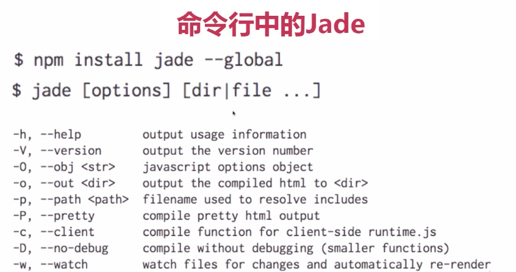

### 安装pug

全局安装pug
```bash
$ npm install --global pug
$ npm install --global pug-cli
```

编译pug文件

```bash
$ pug -P -w index.pug
```

- `-P` 编译后的html便于查看，保留空白节点
- `-w` 持续监控文件修改，修改马上编译

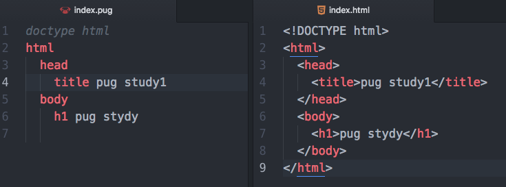

### 类、ID、属性

```
h1#title(class='title2').title pug stydy
#test.test
input(checked,value='ye')
```

编译后
```html
<h1 class="title2 title" id="title">pug stydy</h1>
<div class="test" id="test"></div>
<input checked value="ye">
```

- 属性一般在标签后的括号里面，用逗号隔开。
- 类和ID有点特殊，可以直接在标签后面以链接的形式来写，当然由于也属于属性，也可以使用括号包裹的写法
- div标签可以省略， `div#test.test` 等价于 `#test.test` 。
- 对于没有属性值的直接写就行了，比如 input 里面的checked.

### 多行文本

```
p
  | 1. aa
  | 2. bb
  | 3. cc
```
或者
```
p.
  1. aa
  2. bb
  3. cc
```
编译后
```html
<p>
  1. aa
  2. bb
  3. cc
</p>
```

#### 多行文本中标签的写法分成两种

第一种是带点的纯文本的方式
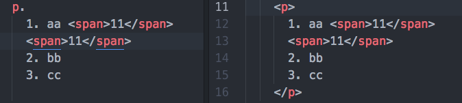

第二种采用缩进的节点方式来写，把文本看做一个文本节点
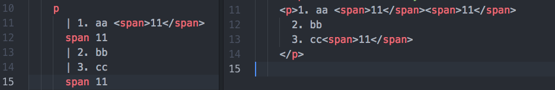

### 注释

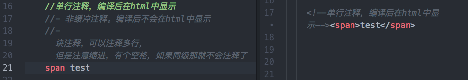

对于IE的条件注释
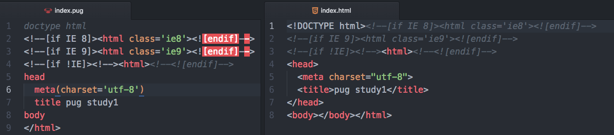

### 行内的style和script写法

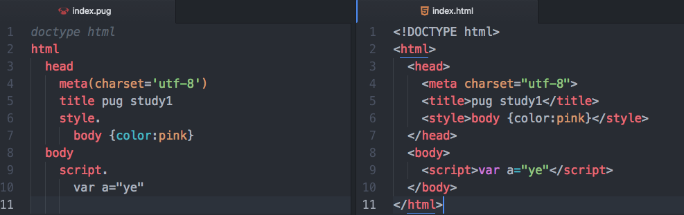

### 声明变量和替换数据

#### 在html中声明变量

括号里面可以对变量做一些js的处理
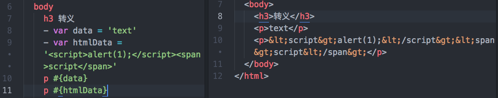

#### 命令行中传值

```bash
$ pug -P -w index.pug --obj '{"name":"xiangwang"}'
```
可以看到页面中接收到了 name 这个变量的值
>如果html中声明的变量和命令行中的变量同名，则html中的变量优先级高
>

#### 通过json文件传变量

创建一个json文件然后命令行中执行以下代码:
```bash
$ pug -P -w index.pug --O data.json
```

### 安全转义与非转义

`安全转义` 也就是有时候我们希望页面中显示标签，也就是html中是转义后的字符。


`非安全转义` 有时候我们就是希望html中显示的就是标签
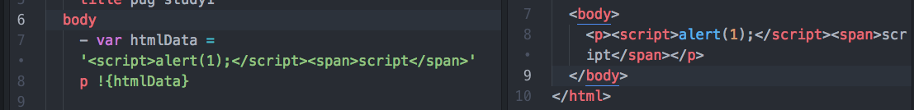

#### 其他的方式

和上面的结果一样
```
p= htmlData
p!= htmlData
```

如果我们有时候想页面中输出 `#{}`和`!{}` 怎么办呢？

```
p \#{htmlData}
p !#{htmlData}
```
就显示成了

```html
<p>#{htmlData}</p>
<p>!{htmlData}</p>
```

### 流程代码 for-each-while

#### for和each的使用方式

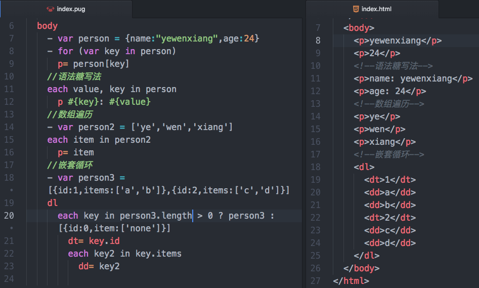

#### white使用方式

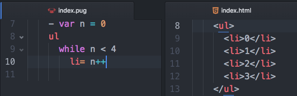

### 流程代码 if-else-unless-swic

#### if-else 的使用方式

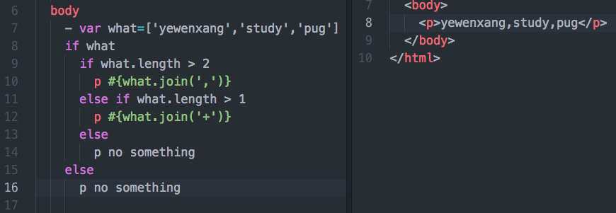

#### unless（除非）

如果是 false 就会往先执行

```
unless !what
  p #{what.length}
```

#### case-when

switch 语句是if-else-if 的兄弟语句,我们在 pug中可以使用 cass-when 来实现的

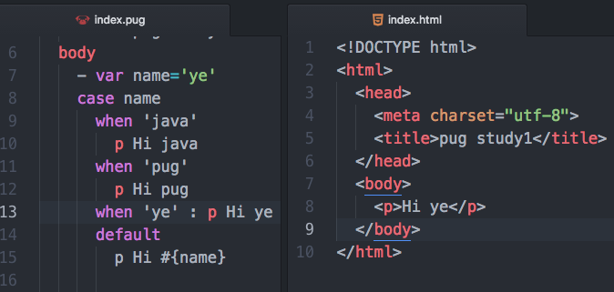
